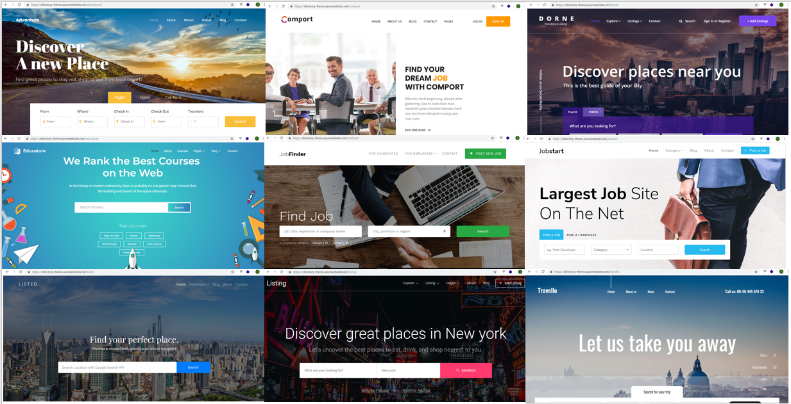
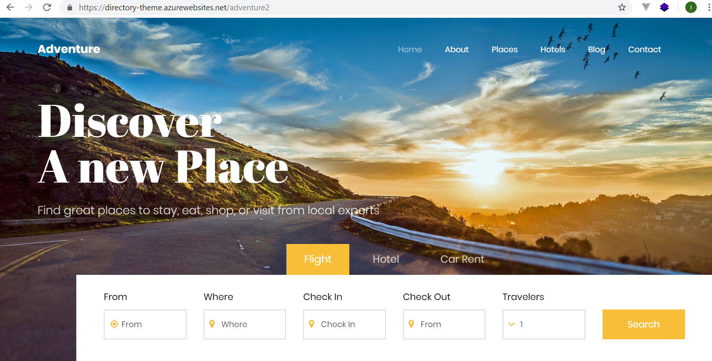
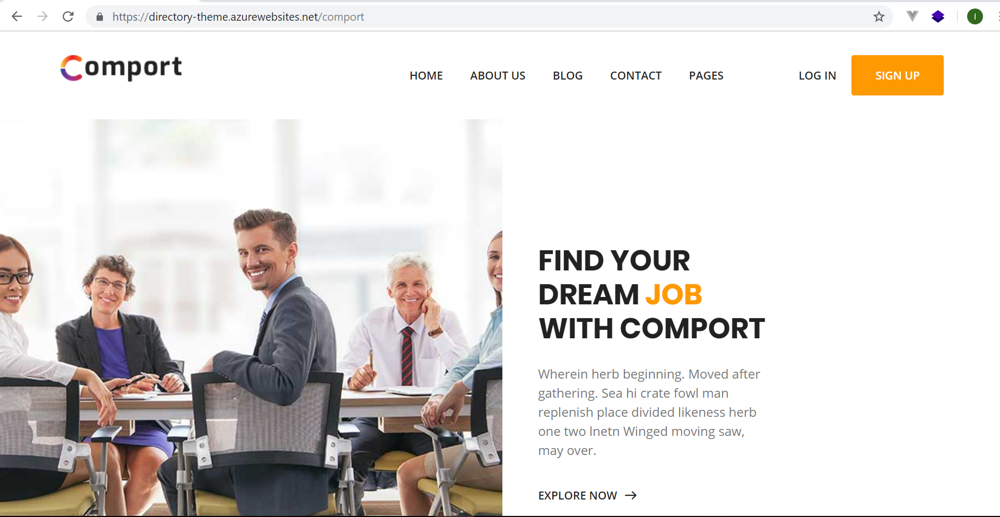
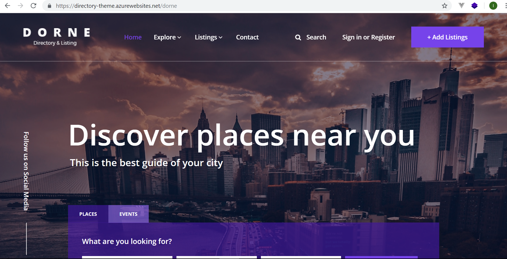
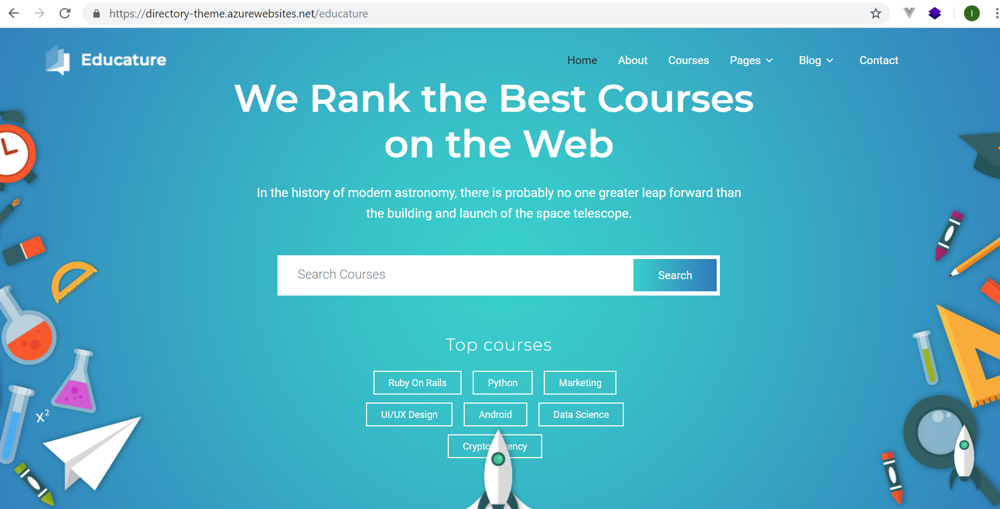
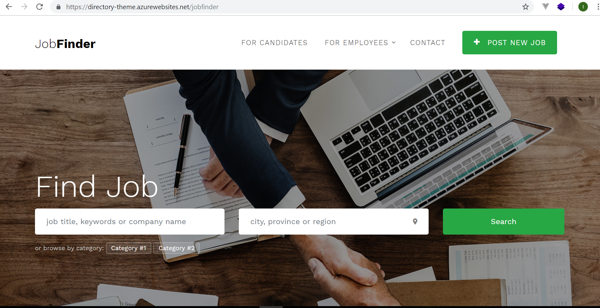
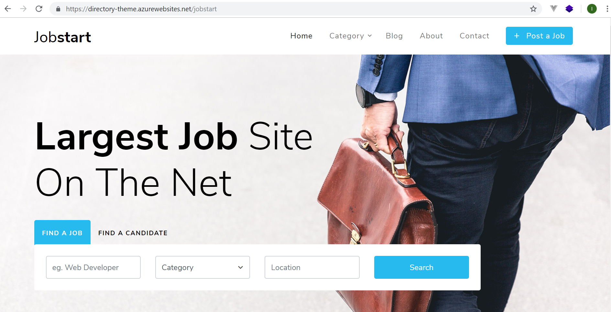
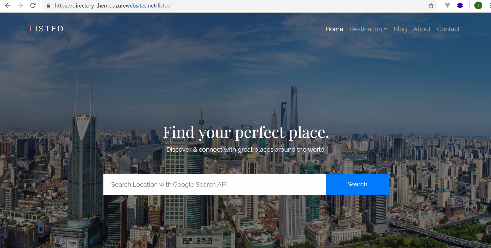
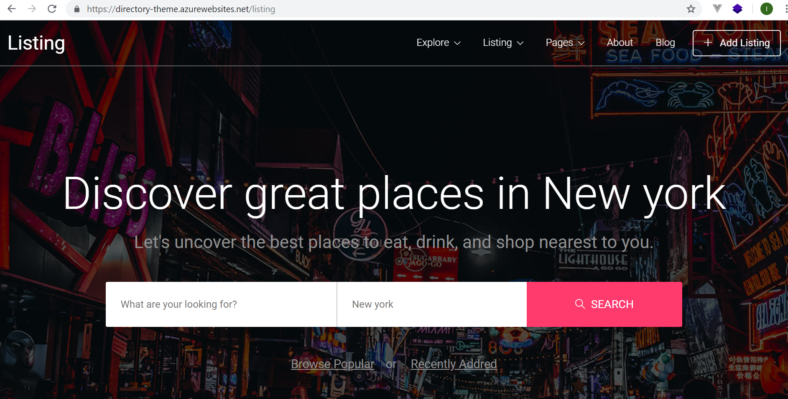
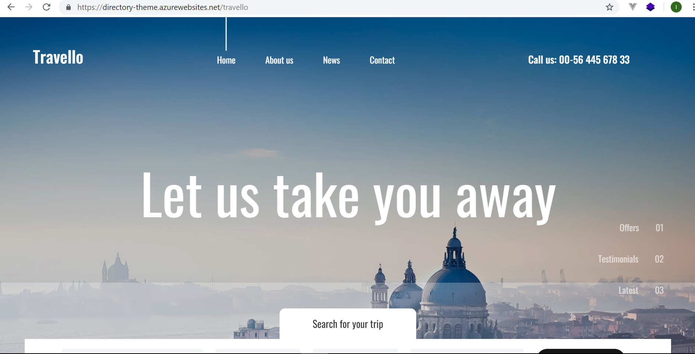

# Directory-Theme-Collections
Beautiful directory theme collections developed using Asp.Net Core 2.2. Azure online demo available.
original HTML version can be download from [Colorlib](https://colorlib.com).
support by [CodeRush.CO] source code collections (https://coderush.co)

1. experience the azure online [demo](https://directory-theme.azurewebsites.net/adventure2)
2. experience the azure online [demo](https://directory-theme.azurewebsites.net/comport)
3. experience the azure online [demo](https://directory-theme.azurewebsites.net/dorne)
4. experience the azure online [demo](https://directory-theme.azurewebsites.net/educature)
5. experience the azure online [demo](https://directory-theme.azurewebsites.net/jobfinder)
6. experience the azure online [demo](https://directory-theme.azurewebsites.net/jobstart)
8. experience the azure online [demo](https://directory-theme.azurewebsites.net/listed)
9. experience the azure online [demo](https://directory-theme.azurewebsites.net/listing)
10. experience the azure online [demo](https://directory-theme.azurewebsites.net/travello)

# Development Tools & Environment

I'm using **Visual Studio Community 2017** for the development tools on Windows 10 machine.

# .Net Core Version

I'm using **.Net Core 2.2**

# Supported by CodeRush.Co
[CodeRush.CO] source code collections (https://coderush.co) lot of open source cool apps there.

